<div align="center">

<!-- Banner SVG -->


<br/>

<!-- Unified Badges -->
<a href="https://github.com/dharshan-X"></a>
&nbsp;&nbsp;

&nbsp;&nbsp;


</div>

<br/>

## 01. PROFILE

Systems and backend engineer focused on writing software that is fast by design, not by accident. Compiling safety, performance, and predictability into production systems.

```rust
// Rust compiler representation of developer attributes
struct Developer {
    name:     &'static str,
    role:     &'static str,
    location: &'static str,
    focus:    &'static [&'static str],
}

const DHARSHAN: Developer = Developer {
    name:     "Dharshan",
    role:     "Systems & Backend Engineer",
    location: "Salem, Tamil Nadu, India",
    focus:    &[
        "Rust",
        "Systems Programming",
        "Compiler Design",
        "Cloud Native",
    ],
};
```

<br/>

## 02. CORE SYSTEM ARCHITECTURE

<!-- Interactive Bento Grid representing domains and technologies -->


<br/>

## 03. TELEMETRY

<div align="center">

<!-- Dual-themed Profile and Language Stats -->
<picture>
  <source media="(prefers-color-scheme: dark)" srcset="https://github-readme-stats.vercel.app/api?username=dharshan-X&amp;show_icons=true&amp;theme=transparent&amp;title_color=DE5E14&amp;text_color=a1a1aa&amp;icon_color=DE5E14&amp;border_color=27272a&amp;bg_color=09090b" />
  <source media="(prefers-color-scheme: light)" srcset="https://github-readme-stats.vercel.app/api?username=dharshan-X&amp;show_icons=true&amp;theme=transparent&amp;title_color=DE5E14&amp;text_color=71717a&amp;icon_color=DE5E14&amp;border_color=e4e4e7&amp;bg_color=ffffff" />
  
</picture>
&nbsp;
<picture>
  <source media="(prefers-color-scheme: dark)" srcset="https://github-readme-stats.vercel.app/api/top-langs/?username=dharshan-X&amp;layout=compact&amp;theme=transparent&amp;title_color=DE5E14&amp;text_color=a1a1aa&amp;icon_color=DE5E14&amp;border_color=27272a&amp;bg_color=09090b" />
  <source media="(prefers-color-scheme: light)" srcset="https://github-readme-stats.vercel.app/api/top-langs/?username=dharshan-X&amp;layout=compact&amp;theme=transparent&amp;title_color=DE5E14&amp;text_color=71717a&amp;icon_color=DE5E14&amp;border_color=e4e4e7&amp;bg_color=ffffff" />
  
</picture>

<br/><br/>

<!-- Dual-themed Streak Stats -->
<picture>
  <source media="(prefers-color-scheme: dark)" srcset="https://github-readme-streak-stats.herokuapp.com/?user=dharshan-X&amp;theme=transparent&amp;background=09090b&amp;border=27272a&amp;stroke=DE5E14&amp;ring=DE5E14&amp;fire=DE5E14&amp;currStreakLabel=a1a1aa&amp;currStreakNum=DE5E14&amp;sideLabels=a1a1aa&amp;sideNums=DE5E14&amp;dates=71717a" />
  <source media="(prefers-color-scheme: light)" srcset="https://github-readme-streak-stats.herokuapp.com/?user=dharshan-X&amp;theme=transparent&amp;background=ffffff&amp;border=e4e4e7&amp;stroke=DE5E14&amp;ring=DE5E14&amp;fire=DE5E14&amp;currStreakLabel=71717a&amp;currStreakNum=DE5E14&amp;sideLabels=71717a&amp;sideNums=DE5E14&amp;dates=a1a1aa" />
  
</picture>

<br/><br/>

<!-- Isometric Contribution Map -->


<br/><br/>

<!-- Contribution Snake Animation -->
<picture>
  <source media="(prefers-color-scheme: dark)" srcset="https://github.com/dharshan-X/dharshan-X/blob/output/github-snake-dark.svg" />
  <source media="(prefers-color-scheme: light)" srcset="https://github.com/dharshan-X/dharshan-X/blob/output/github-snake.svg" />
  
</picture>

</div>

<br/>

## 04. CONNECT

If you want to discuss systems programming, compiler engineering, or potential projects:

* **Email** : you@email.com
* **LinkedIn** : [dharshan-X](https://linkedin.com/in/dharshan-X)
* **Twitter** : [dharshan-X](https://twitter.com/dharshan-X)
